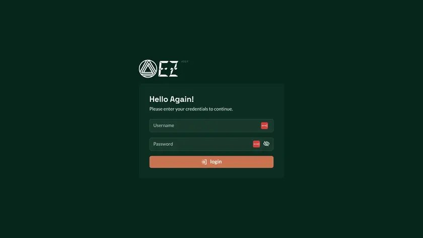

```
This project is still under active development (alpha stage).
Expect bugs early on. Create issues so they can be fixed.
```

# Infinite Ez &middot; [](https://github.com/orgs/goinfinite/projects/8/views/2) [](https://ez.demo.goinfinite.net:3141/) [](https://github.com/orgs/goinfinite/discussions) [](https://goreportcard.com/report/github.com/goinfinite/ez) [](https://github.com/goinfinite/ez/blob/main/LICENSE.md)

Infinite Ez is yet another self-hosted container management platform that transforms any server or VPS into a platform as a service (PaaS), à la Heroku, Render or Vercel. The beauty of it is that **you don't need to be a DevOps expert** to use it - it's designed for the average user, with a user-friendly interface that automates all those complex tasks, like deployment intricacies, scaling policies and server maintenance.

Besides handling deployment, Infinite Ez also provides account management with granular hardware resources allocations, advanced container autoscaling, basic server monitoring, container images with import, export and snapshots & automatic port bindings mapping based on the container image you select. It's a one-stop solution for all your container management needs.



What's more, Infinite Ez is notably lightweight, thanks to Go under the hood. It consumes only about 100 MB of RAM on average (for the binary). It runs on [OpenSUSE MicroOS](https://microos.opensuse.org/), an immutable operating system **specifically designed for containers**. This setup ensures the system is secure, reliable, and easy to maintain, with automatic updates and rollback capabilities.

If your application isn't containerized yet, fret not. Check out the [Infinite OS](https://github.com/goinfinite/os) project. It's an open-source container-first operating system that simplifies containerizing your apps to just a few clicks, **all via a web interface** - no need to grapple with complex Dockerfiles.

Now, Infinite Ez is a _fair source_ software. The FCL license is a mostly-permissive non-compete Fair Source license that eventually transitions to Open Source after 2 years. As explained on the [Fair Core website](https://fcl.dev/):

```
The FCL is a Fair Source license that allows a user to read, use, modify, and redistribute a project, where "use" is any use case that does not compete with the business interests of the author. For the large majority of users, this will mean that the user can use the project how they see fit, since most users do not wish to compete with the author.
```

If you're a hosting/infrastructure provider, we'll soon be offering an excellent white-label add-on that lets you customize the dashboard and use it commercially. In the meantime, [do get in touch](mailto:eng+ez@goinfinite.net) if you're interested in using Infinite Ez in your hosting service - we're eager to find a **fair** way to work together.

## Installation

1. Download Ez binary from [releases page](https://github.com/goinfinite/ez/releases) (the .zip on Assets section);

2. Download the openSUSE MicroOS cloud-init image (use the "Base System + Container Runtime" version) from the [MicroOS download page](https://en.opensuse.org/Portal:MicroOS/Downloads);

3. Upload the image to your infrastructure provider and deploy a VM with it. You must also add a secondary unformatted disk to the VM which will be used by Ez to store the users data;

4. SSH into the VM and create the `/var/infinite/` directory;

5. Upload (and extract) the Ez binary to `/var/infinite/`, giving it execution permission right after:

```
chmod +x /var/infinite/ez
```

6. Run the installer:

```
/var/infinite/ez sys-install
```

7. The system will reboot and you can check with `systemctl status ez` if the service is running. You should now be able to access the dashboard with your browser on the `https://vm-ip-address:3141/` address.

_We are aware the installation process is not user-friendly yet. The installation process will be completely [refactored soon](https://github.com/goinfinite/ez/issues/140) so it happens on the Web UI and without the need of a secondary disk. An [official ISO](https://github.com/goinfinite/ez/issues/77) will also be made available for download so you will be able to skip all the steps above, boot the ISO on your VM provider and go straight to the Setup Wizard on the Web UI._

## REST API

The REST API is exposed on port 3141 via HTTPS on the endpoint `/api/`. The API endpoint are versioned and the version is part of the URL.

### Swagger // OpenAPI

The API is documented using Swagger/OpenAPI 2.0 and the documentation can be found on the `/api/swagger/` endpoint.

To generate the swagger documentation, you must use the following command:

```
swag init -g src/presentation/api/api.go -o src/presentation/api/docs
```

The annotations are in the controller files. The reference file can be found [here](https://github.com/swaggo/swag#attribute).

### Authentication

The API accepts two types of tokens and uses the standard "Authorization: Bearer \<token\>" header:

- **sessionToken**: is a JWT, used for dashboard access and generated with the user login credentials. The token contains the accountId, IP address and expiration date. It expires in 3 hours and only the IP address used on the token generation is allowed to use it.

- **accountApiKey**: is a token meant for M2M communication. The token is a _AES-256-CTR-Encrypted-Base64-Encoded_ string, but only the SHA3-256 hash of the key is stored in the server. The accountId is retrieved during key decoding, thus you don't need to provide it. The token never expires, but the user can update it at any time.

## Development

Infinite Ez is written using Clean Architecture, DDD, TDD, CQRS, Object Calisthenics, etc. Understand how these concepts works before proceeding is advised.

To run this project during development you must install [Air](https://github.com/cosmtrek/air). Air is a tool that will watch for changes in the project and recompile it automatically.

Since Ez relies on the operational system being openSUSE MicroOS, the entire development and testing should be done in a VM. The VM can be created with the following steps:

1. Install VMWare Player;

2. Download the VMware `.vmx` and `.vmdk` files from "Base System + Container Runtime" column on [MicroOS download page](https://en.opensuse.org/Portal:MicroOS/Downloads).

Note: make sure you downloaded the "Base System + Container Runtime" files and not the "Base System" files.

3. Extract the `.vmdk` file if it came compressed.

4. Add the VM to the VMWare Player interface using the "Open a Virtual Machine" option and then:

   1. Change the resources to 4GB RAM // 2vCPU;
   2. Remove the default disk;
   3. Remove the floppy drive;
   4. Add a new disk selecting "Use an existent disk" and use the .vmdk file you downloaded (keep the format when asked);
   5. Add a secondary disk (5GB minimal - do not format);
   6. Add a Network Adapter (keep set to NAT mode);

5. Run the VM. The first boot will allow you to set up a root password. Keep the keyboard to US layout to avoid issues. After the first reboot, login with the password you set.

6. Add your public SSH key to `/root/.ssh/authorized_keys` file. I would recommend uploading your .pub to a Pastebin, File.io or similar service and then using curl to download it to the VM as curl is installed by default.

Note: If you use Pastebin, make sure you're downloading the raw file and not the HTML page.

7. Install git and Go and reboot:

```
transactional-update pkg install git make
curl -L https://go.dev/dl/go1.23.3.linux-amd64.tar.gz -o go.tar.gz
tar -C /usr/local -xzf go.tar.gz
rm -f go.tar.gz
echo 'export PATH=$PATH:/usr/local/go/bin:~/go/bin' >> ~/.bashrc
echo 'alias ez-swag="swag init -g src/presentation/api/api.go -o src/presentation/api/docs"' >> ~/.bashrc
systemctl reboot
```

8. After the reboot, you'll need to configure GitHub authentication. The `.ssh/config` file is your friend, this is an example:

```
Host github.com
  HostName github.com
  User git
  IdentityFile ~/.ssh/the_github_key
```

Replace `the_github_key` with the path to your private key and remember to chmod the key to 400.

9. Install a few Go packages and clone the Ez repository:

```
go install github.com/swaggo/swag/cmd/swag@latest
go install github.com/air-verse/air@latest
go install github.com/a-h/templ/cmd/templ@latest
git config --global user.name "yourgithubnick"
git config --global user.email yourgithubemail
git clone git@github.com:goinfinite/ez.git
```

10. Build the project and run the installer:

```
cd ez; air # hit CTRL-C after running this
chmod +x /var/infinite/ez
/var/infinite/ez sys-install
```

11. **The system will reboot** and once see Ez running via systemd, you should be able to use the [Visual Studio Remote SSH extension](https://code.visualstudio.com/docs/remote/ssh) to connect to the VM and manage the project.

Make sure to use the SSH key to connect to the VM and not the password. The IP address of the VM can be found on the VMWare interface which you used to SSH. If you don't see it, just use `exit` to return to the login screen and the IP will be displayed there.

You should also install these VSCode extensions during development:

```
EditorConfig.EditorConfig
GitHub.copilot
GitHub.vscode-pull-request-github
esbenp.prettier-vscode
foxundermoon.shell-format
golang.go
hbenl.vscode-test-explorer
ms-vscode.test-adapter-converter
redhat.vscode-yaml
streetsidesoftware.code-spell-checker
streetsidesoftware.code-spell-checker-portuguese-brazilian
timonwong.shellcheck
bradlc.vscode-tailwindcss
Trapfether.tailwind-raw-reorder
a-h.templ
```

12. The install process also creates a systemd unit to run the project. Use the following commands to disable the service so you can run the project manually with Air during development:

```
systemctl disable ez
systemctl stop ez
```

### Environment Variables

You must have an `.env` file in the root of the git directory **during development**. You can use the `.env.example` file as a template. Air will read the `.env` file and use it to run the project during development.

If you add a new env var that is required to run the apis, please add it to the `src/presentation/shared/checkEnvs.go` file.

When running in production, the `/var/infinite/.env` file is only used if the environment variables weren't set in the system. For instance, if you want to set the `ENV1` variable, you can do it in the `.env` file or in the command line:

```
ENV1=XXX /var/infinite/ez
```

### Dev Utils

The `src/devUtils` folder is not a Clean Architecture layer, it's there to help you during development. You can add any file you want there, but it's not recommended to add any file that is not related to development since the code there is meant to be ignored by the build process.

For instance there you'll find a `testHelpers.go` file that is used to read the `.env` during tests.

### Web UIs

This project has two web UIs for the moment, the previous Vue.js frontend and the new HTMX frontend. The Vue.js frontend is deprecated and will be removed in the future. It's available at `/_/` and the HTMX frontend is available at `/`.

The HTMX frontend has a hot reload feature that will reload the page when the assets are changed. It's based on a websocket connection that the client listens to and will reload the page when the server stops responding (which is when Air is rebuilding the binary after a file change). To enable this feature, simply put a `DEV_MODE=true` in the `.env` file.
